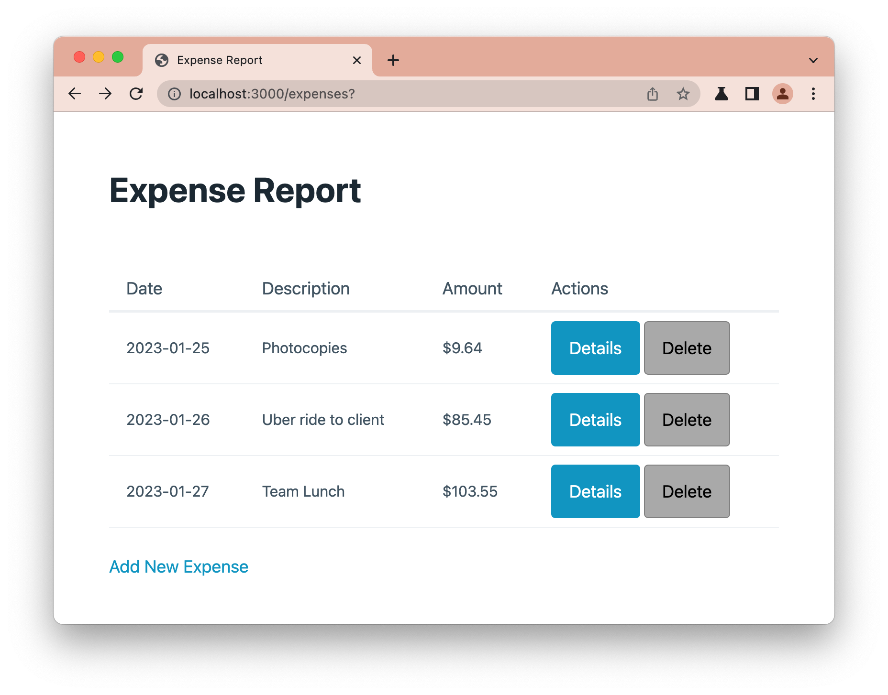
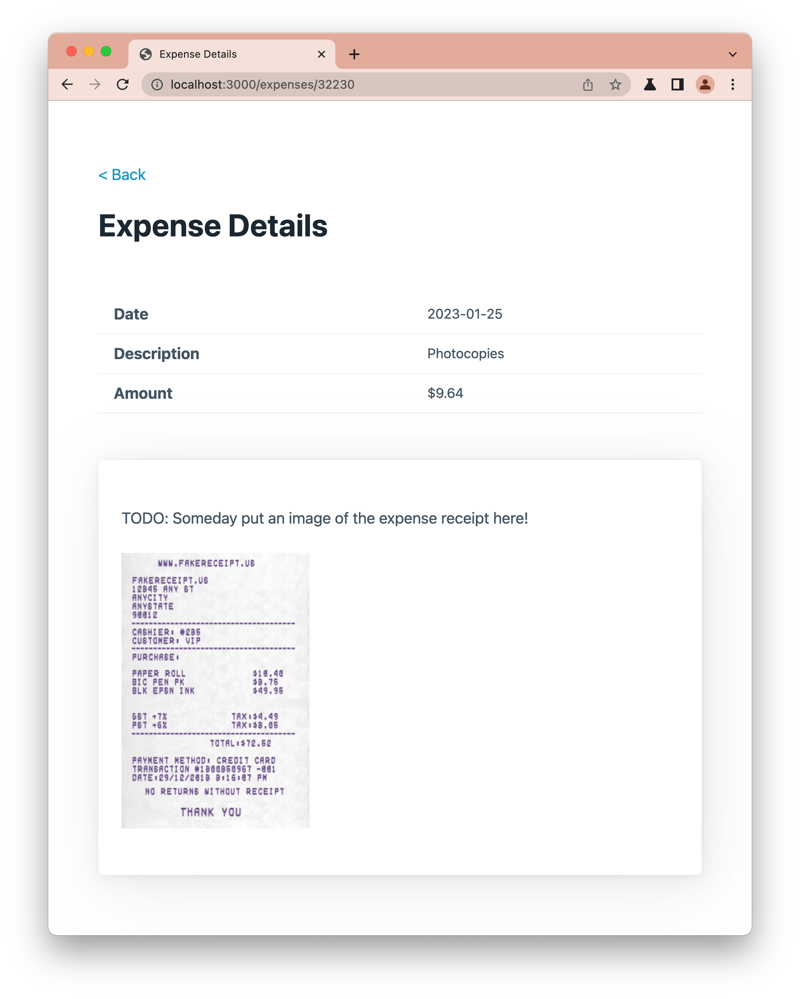
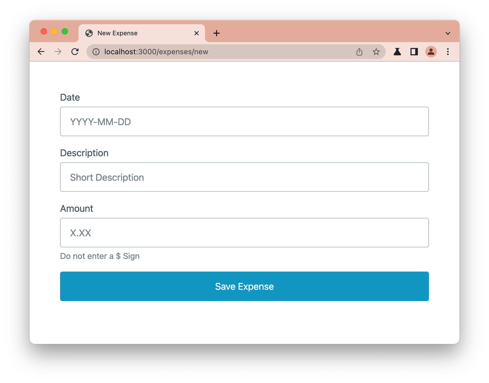

# Express Middleware WBP


Expense reports! Nobody likes doing them. But you've got no choice to file them if you want money back from your employer for stuff you paid for while working.

Luckily, you've got some mad programming skills, so you decide to write a little web app that'll help you organize your work expenses.

You were even able to rope in a designer to help with writing some of the HTML, in exchange for letting them use the app when you're done. Score!

You're already halfway done -- all you have left to do is to code up the ability to add new expenses and to delete expenses.

---


- Routing `POST` and `DELETE` HTTP requests
- Implementing `create`, `new`, and `delete` controller actions
- Implementing creation and deletion model methods
- Submitting `POST` and `DELETE` HTTP requests via HTML forms

---


---


#### Step 1:

- Fork and clone this repository
- Navigate (`cd`) into the repository folder in your console
  - Run the command `npm install` -- this will install the modules necessary for the automated tests to run
- Open up the repository folder in your code editor
- Run the app with `nodemon`
  - Navigate to `localhost:3000` and click around the app to familiarize yourself with it
- Right off the bat, you see the the following links/buttons are not working:
  - `Add New Expense`, and
  - The <kbd>Delete</kbd> button for each expense



- The <kbd>Details</kbd> link seems ok! Yes! Less to do!



#### Step 2:

- The first step is to get that `Add New Expense` link working
- Your designer friend already coded up an HTML mockup for the **New Expense** form; it's been placed in `views/expenses/new.ejs`
- All you have to do right now is write an appropriately named controller action to render the `new.ejs` template, export it, and then to route it up. As easy as pie!
- **IMPORTANT**: You should render it using the title `New Expense` in order for the automated tests to give you a pass!
- To check that you did everything right, you should:
  - Click on the `Add New Expense` link to make sure it actually loads,
  - Run these two tests:
    - `npm test -- -t 'render new expense form'` (this will test your controller)
    - `npm test -- -t 'route the new action'` (this will test your routing)



#### Step 3:

- OK, now that the form is rendering, when you type stuff into the form and click the button, nothing happens. You ask your designer friend and they said: _"Well, I coded up an HTML mockup, but I don't know anything about backend programming, so it's up to you to make the form actually work."_ Time to roll up your sleeves.
- Open up the `views/expenses/new.ejs` file
- You'll need to fix the form so it can actually submit the data!
- **Hint 1**: You'll need to update the `<form>`, `<input>`, and `<button>` tags
  <details>
    <summary><strong>Hint 2 (Click here to reveal Spoiler)</strong></summary>
    
    You'll need to update the:
    * `action`, and `method` attributes of the `<form>` tag
    * `name` attribute of the `<input>` tag
    * `type` attribute of the `<button>` tag
  </details>
- To check that you did everything right, you should:
  - Run this test:
    - `npm test -- -t 'render the new template'` (this will test the view)
  - Click the `Save Expense` button to see that it actually tries to submit
    - You'll get an error though because you haven't written the code to deal with the submitted data, that's next!

#### Step 4:

- The form now submits, but you realize you haven't written the proper controller action and model function to deal with the submitted data
- First, write an appropriately-named model function that actually inserts the new expense into the existing array of expenses
  - To calculate an `id` for the new expense, use the same quick-n-dirty line of code from class, like:
    ```
    expense.id = Date.now() % 1000000;
    ```
  - **Hint**: You'll find the `.push()` method useful in writing this function
  - Don't forget to export it the function!
- Next, write an appropriately-named controller action to accept the form data that was submitted via an HTTP `POST` request, and do something with it.
  - Make use of the model function that you just wrote!
  - What should happen after the new expense has been created?
    - `.redirect()` back to the index of expenses, of course
  - Don't forget to export it and then route it properly
- To check that you did everything right, you should:
  - Try it in the user interface and see that created expenses show up on the index page!
  - Run this test:
    - `npm test -- -t 'should create an expense'` (this will test your controller and model)
    - `npm test -- -t 'route the create action'` (this will test your routing)

#### Step 5:

- Almost done! The only thing left to is to add the ability to delete expenses. This is important if, for example, you entered an invalid expense
- Before we can implement this, recall that you'll have to install the `method-override` package in order to be able to submit `DELETE` requests via a form
   - Go ahead and install it now. How d'ya do that again? Check your class notes! 
   - Don't forget to update your `server.js` file to use that `method-override` module after it's installed (check your class notes!)
- To check that you've installed it correctly:
   - Run these tests:
     - `npm test -- -t 'method-override should be installed'`
     - `npm test -- -t 'method-override should be required'`

#### Step 6:

- Again, your designer friend already coded up an HTML mockup for the form containing the <kbd>Delete</kbd> button inside `views/expenses/index.ejs`. Open that file up up!
- Using what you learned, fix the form so it can actually submit the data.
- **Hint 1**: You'll need to update the `<form>` and `<button>` tags
  <details>
    <summary><strong>Hint 2 (Click here to reveal Spoiler)</strong></summary>

    You'll need to update the:
    * `action`, and `method` attributes of the `<form>` tag
    * `type` attribute of the `<button>` tag
  </details>
- To check that you did everything right, you should:
  - Run this test:
    - `npm test -- -t 'render the index template'`
  - Click the `Delete` button on any expense to see that it actually tries to submit
    - You'll get an error though because you haven't written the code to deal with the submitted data, that's next!

#### Step 7:

- Now we can proceed to actually deleting expenses
- Again, the form now submits, and again, the proper controller action and model function to deal with the submitted data haven't yet been written
- First, write an appropriately-named model function that looks up an expense by its `id` and then removes it from the existing array of expenses
  - **Hint**: You'll find the `.findIndex()` and `.splice()` methods to be pretty useful in writing this function
- Next, write an appropriately-named controller action to process the HTTP `DELETE` request
  - What should happen after the expense has been deleted?
    - `.redirect()` back to the index of expenses, of course
  - Don't forget to export it and then route it properly
- To check that you did everything right, you should:
  - Try it in the user interface and see that created expenses show up on the index page!
  - Run this test:
    - `npm test -- -t 'should delete an expense'` (this will test your controller and model)
    - `npm test -- -t 'route the delete action'` (this will test your routing)

## The End

- Be sure the user interface of your app is working by checking `localhost:3000` and clicking through all the links, adding, viewing, and deleting expenses
- Run all the tests all together with `npm test`
- You're done if everything is passing!
